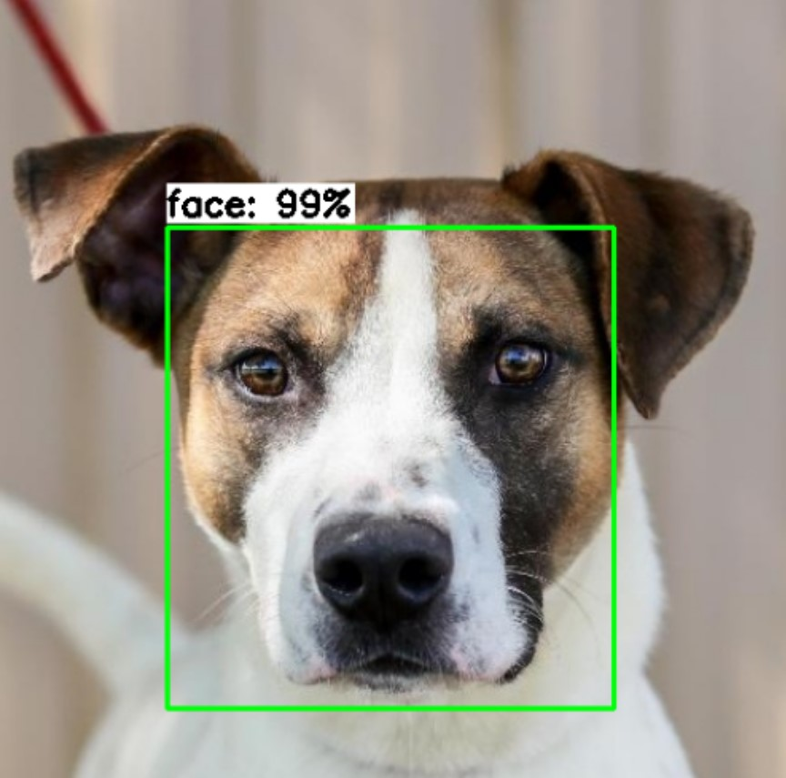

# Automated dog door using facial recognition technology

The objective of this project is to demonstrate the feasibility of automating a dog door by using dog recognition technology to determine which dog is outside and if it is permitted to enter.

## Introducing test subjects

  

# How does it work?
## Face detection
The first step in recognizing a face in real-time is to detect the face itself. For this task, I selected the SSD-MobileNetV2-fpnlite model.

I used a pre-trained model from the TensorFlow model garden to transfer learn on data I labeled using the Visual Object Tagging Tool (VoTT). 
The original model was trained on the COCO 2017 dataset.

the model config can be found: https://github.com/tensorflow/models/blob/master/research/object_detection/configs/tf2/ssd_mobilenet_v2_fpnlite_320x320_coco17_tpu-8.config 

### SSD-MobileNetV2-fpnlite
this model consist of 3 parts
* MobileNet-v2 as the backbone network used for feature extraction
* SSD head (Single Shot Detection) for detection
* FPN-Lite (Feature Pyramid Network) to combine the output of the MobileNet v2 and SSD layers

### MobileNet-v2
MobileNet is a light-weight neural network architecture designed for mobile and embedded devices. It is designed to be efficient in terms of memory and computational resources, making it well-suited for use on devices with limited resources.
It is used as the base network of the model to extract features

The fully connected layer used for classification is removed, so we have a model that can extract features but leaves the spatial structure of the image.

### SSD
The SSD head is a set of one or more convolutional layers added to the model to predict bounding boxes instead of classifying. It employs a set of predefined bounding boxes, referred to as anchor boxes, to predict the location and class of objects in an input image. The SSD head combines the predictions from these anchor boxes with a non-maximum suppression (NMS) algorithm to produce the final detection results. This method of detection takes the extracted features and uses them to identify the location of objects in the image.

### FPN-lite

FPN Lite is a lightweight version of the Feature Pyramid Network (FPN) architecture.
The FPN Lite module is used to combine the output of the MobileNet v2 and SSD layers, by combining features from multiple scales, the FPN Lite module provides the object detector with additional contextual information that can help improve the accuracy of the object detections.

#### Example:

  

## Face recognition 

# Does it work?
This is a demonstration of the model in action. The frame rate for detection is approximately 0.7, which decreases when a detected face is being processed. To determine if this model can function in real-time, we must evaluate the time it takes for each detection. If the detection process takes longer than 2 seconds, it may impact the functionality of the dog door.

  

The proof of concept protoype has also been tested, u can see muchu jumping through the door after many training sessions.

  

In the video below, you can observe the locking mechanism in action. As you can see, there are two servo arms on each side that lock the door. It is important to note that this is only a proof of concept, and in reality, stronger servos or arms would be required as any dog can jump through and knock off these arms.

  

# Sources

https://github.com/tensorflow/models
