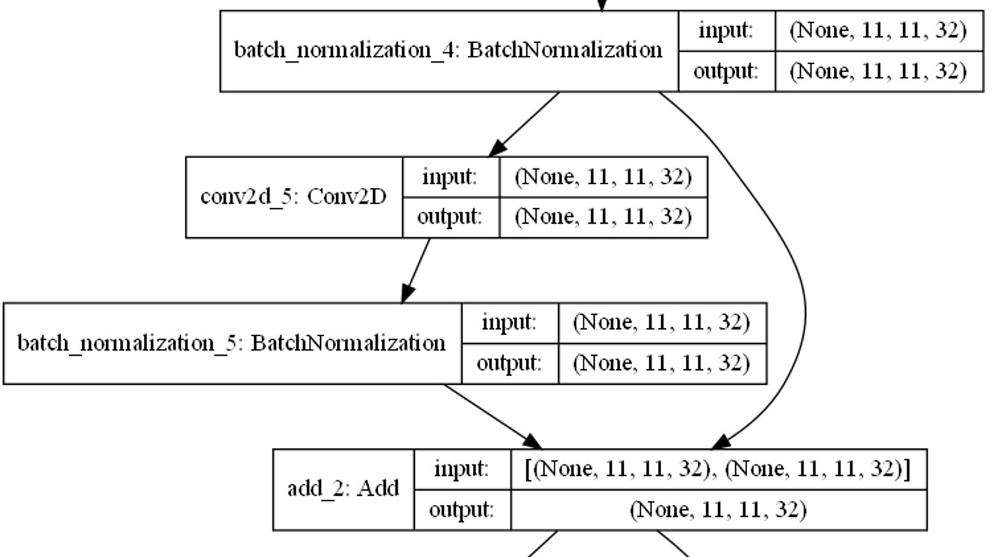

# Automated dog door using facial recognition technology

The objective of this project is to demonstrate the feasibility of automating a dog door by using dog recognition technology to determine which dog is outside and if it is permitted to enter.

The project was realized using a Raspberry Pi model 3b+ using a camera module v2.

## Introducing test subjects

  

# How does it work?
## Face detection
The first step in recognizing a face in real-time is to detect the face itself. For this task, I selected the SSD-MobileNetV2-fpnlite model.

I used a pre-trained model from the TensorFlow model garden to transfer learn on data I labeled using the Visual Object Tagging Tool (VoTT). 

The original model was trained on the COCO 2017 dataset.
The data used for transfer learning is a mix of the CatsVsDogs dataset and Animalfaces dataset, both linked below in sources.

the model config can be found: https://github.com/tensorflow/models/blob/master/research/object_detection/configs/tf2/ssd_mobilenet_v2_fpnlite_320x320_coco17_tpu-8.config 

### SSD-MobileNetV2-fpnlite
this model consist of 3 parts
* MobileNet-v2 as the backbone network used for feature extraction
* SSD head (Single Shot Detection) for detection
* FPN-Lite (Feature Pyramid Network) to combine the output of the MobileNet v2 and SSD layers

### MobileNet-v2
MobileNet is a light-weight neural network architecture designed for mobile and embedded devices. It is designed to be efficient in terms of memory and computational resources, making it well-suited for use on devices with limited resources.
It is used as the base network of the model to extract features

The fully connected layer used for classification is removed, so we have a model that can extract features but leaves the spatial structure of the image.

#### Why MobileNetV2?
MobileNet V2 is designed to be lightweight and efficient, with a smaller number of parameters and lower computational requirements. Additionally, MobileNet uses depthwise separable convolutions, which can be implemented more efficiently on mobile and embedded devices.

These depthwise seperable convolutions are the middel layer of the Bottleneck Residual Blocks used in Mobilenet V2
The first layer is the expansion layer, a 1x1 convolution layer with the purpose to expand the number of channels in the data before moving on too depthwise convolution (explained below) and finally to the Bottleneck layer, this layer makes the number of channels smaller. 
As the name suggest this block makes use of a residual connection to help with the flow of gradients through the network.
More on residual blocks in the face recognition explanation.

#### Depthwise separable convolutions 
A standard convolutional layer applies a set of filters to the input, where each filter is responsible for detecting a specific feature in the input. In a depthwise separable convolution, the filters are applied separately to each channel of the input, rather than to the whole input. This results in a reduction in the number of parameters that need to be learned, and thus a decrease in computational cost.

### SSD
The SSD head is a set of one or more convolutional layers added to the model to predict bounding boxes instead of classifying. It employs a set of predefined bounding boxes, referred to as anchor boxes, to predict the location and class of objects in an input image. The SSD head combines the predictions from these anchor boxes with a non-maximum suppression (NMS) algorithm to produce the final detection results. This method of detection takes the extracted features and uses them to identify the location of objects in the image.

The Single Shot Detector (SSD) works by:

* Breaking down the input image into a grid of cells and running object detection on each cell. If no objects are detected, the cell is classified as the background class.
* Using default bounding boxes, called anchor boxes, to predict the location and class of objects within each cell. During training, the algorithm matches the appropriate anchor box with the bounding boxes of each ground truth object within an image. The anchor box with the highest degree of overlap with an object is used to predict that object's class and location.

> Image source: MobileNet version 2 by Matthijs Hollemans https://machinethink.net/blog/mobilenet-v2/

### FPN-lite

FPN Lite is a lightweight version of the Feature Pyramid Network (FPN) architecture.
The FPN Lite module is used to combine the output of the MobileNet v2 and SSD layers, by combining features from multiple scales, the FPN Lite module provides the object detector with additional contextual information that can help improve the accuracy of the object detections.

#### Example:

  

## Face recognition 

For recognising which dog face was detected i used a CNN network implementing techniques from FaceNet.
the techniques used are:
* Triplet loss
* Residual blocks (ResNet)

## Triplet loss
The idea behind triplet loss is to train the network to produce embeddings such that similar examples are close together in the embedding space, while dissimilar examples are far apart.
The triplet loss is calculated using three inputs: an anchor image, a positive image, and a negative image. Anchor and positive are selected from the same class, while negative is selected from a different class. The goal of the network is to minimize the distance between images from the same class and maximize the distance with other classes.

  

> Image Source: Face Recognition with FaceNet and MTCNN by Luka Dulčić https://arsfutura.com/magazine/face-recognition-with-facenet-and-mtcnn/

### Online triplet generation
As outlined in the FaceNet paper (https://arxiv.org/abs/1503.03832), if faces are mislabeled or poorly imaged, they can dominate the hard positives and negatives. Despite my data being limited and well-labeled, I employed online triplet generation to select hard positive and negative triplets within a mini-batch. Hard triplets are defined as those where the positive image is closer to the negative image than to the anchor image. This technique helps to improve the robustness of the model against poorly imaged or mislabeled faces.

## Residual blocks
In a standard neural network architecture, the output of one layer is passed as input to the next layer in the sequence. However, in a network with residual blocks, the output of a layer is passed not only to the next layer but also to one or more layers further down the chain, bypassing one or more intermediate layers. This allows for the flow of information to be retained and reused throughout the network, rather than being lost or distorted as it passes through multiple layers.

why use these?
to help alleviate the problem of vanishing gradients. when training networks with many layers the gradients of the parameters with respect to the loss become very small, making it difficult for the network to learn.
Residual blocks address this problem by allowing the gradients to flow more easily through the network by using a residual connection for the gradients to flow through which bypasses one or more layers and allows the input to be added directly to the output of a layer several layers deeper in the network. This helps to retain information and gradients throughout the network.

### Example Residual block in my model:

  

> Find full model: https://github.com/BenjaminVierstraete2/Facial_Recognition_dogdoor/blob/main/FaceRecognition/models/model_plot.png

### Predicting:

Finally, the output of the model is a vector storing 128 embeddings. These embeddings are values assigned to the face. A database was made for each dog using these embeddings. This is used to predict new embeddings by measuring the minimum distance found when comparing to the database. When testing the model without a threshold, it scored 100% on the limited data of 33 test images. However, the score dropped to about 88% when introducing a minimum threshold of 0.5, meaning the dog is only classified if the minimum distance found is smaller then the threshold given.

#### Example predictions:

  

# Tensorflow lite

Both models were converted into tensorflow lite models.
TensorFlow Lite is a lightweight version of TensorFlow that is specifically designed for mobile and embedded devices. It is a good choice for running machine learning models on a Raspberry Pi, as it is optimized for low-power and resource-constrained devices. 
TensorFlow Lite uses a smaller, more efficient binary format for model storage.

#### Benchmark test on Tensorflow (left) and Tensorflow lite (right) in Interference speed (ms)

  

> Image Source: Benchmarking TensorFlow and TensorFlow Lite on the Raspberry Pi by Alasdair Allan https://www.hackster.io/news/benchmarking-tensorflow-and-tensorflow-lite-on-the-raspberry-pi-43f51b796796

# Autopreprocessing model

I initially made a poor choice in my object detection model for my Raspberry Pi application because I was primarily focused on recognition. After training a YOLOv7 model on the same data, I realized that while it was more accurate, it was also much more computationally expensive and difficult to convert to TensorFlow Lite, making it a less suitable choice for embedded detection in comparison to SSD-MobileNetV2. Despite this, YOLOv7 can still be useful for object detection on devices with powerful GPUs or in cloud-based applications. 

Using this trained model i developed an automatic preprocessor that generates faces for training the recognition model. By simply providing a folder with images of dogs, the preprocessor will output all detected faces into a separate folder, leaving only the moving of the good faces into a labeled folder and removing off poor images.

### Output:

  

# Does it work?
This is a demonstration of the model in action. The frame rate for detection is approximately 0.7, which decreases when a detected face is being processed. To determine if this model can function in real-time, we must evaluate the time it takes for each detection. If the detection process takes longer than 2 seconds, it may impact the functionality of the dog door.

  

The proof of concept protoype has also been tested, u can see muchu jumping through the door after many training sessions.

  

In the video below, you can observe the locking mechanism in action. As you can see, there are two servo arms on each side that lock the door. It is important to note that this is only a proof of concept, and in reality, stronger servos or arms would be required as any dog can jump through and knock off these arms.

  

If u are interested in the prototype and how it is wired? See the manuals folder for more information.

# Sources

## Object detection sources

Tensorflow garden https://github.com/tensorflow/models

MobileNet version 2 https://machinethink.net/blog/mobilenet-v2/

TensorFlow Lite Object Detection on Android and Raspberry Pi https://github.com/EdjeElectronics/TensorFlow-Lite-Object-Detection-on-Android-and-Raspberry-Pi

MobileNetV2 SSD FPN https://docs.edgeimpulse.com/docs/edge-impulse-studio/learning-blocks/object-detection/mobilenetv2-ssd-fpn

How single-shot detector (SSD) works? https://developers.arcgis.com/python/guide/how-ssd-works/

## Face recognition sources

Residual blocks — Building blocks of ResNet https://towardsdatascience.com/residual-blocks-building-blocks-of-resnet-fd90ca15d6ec

DogFaceNet https://github.com/GuillaumeMougeot/DogFaceNet

FaceNet: A Unified Embedding for Face Recognition and Clustering https://arxiv.org/pdf/1503.03832.pdf

What is the Best Facial Recognition Software to Use in 2022? https://towardsdatascience.com/what-is-the-best-facial-recognition-software-to-use-in-2021-10f0fac51409

Introduction to FaceNet: A Unified Embedding for Face Recognition and Clustering https://medium.com/analytics-vidhya/introduction-to-facenet-a-unified-embedding-for-face-recognition-and-clustering-dbdac8e6f02

Face Recognition Walkthrough--FaceNet https://www.pluralsight.com/guides/face-recognition-walkthrough-facenet

A Low-Cost Raspberry Pi-based System for Facial Recognition. https://web.p.ebscohost.com/ehost/detail/detail?vid=0&sid=20f3ec70-9892-4c13-9e7e-68f23e4706b0%40redis&bdata=JkF1dGhUeXBlPXNzbyZzaXRlPWVob3N0LWxpdmU%3d#AN=154571914&db=asn

What’s the Difference Between Haar-Feature Classifiers and Convolutional Neural Networks? https://towardsdatascience.com/whats-the-difference-between-haar-feature-classifiers-and-convolutional-neural-networks-ce6828343aeb

## Other

Benchmarking TensorFlow and TensorFlow Lite on the Raspberry Pi https://www.hackster.io/news/benchmarking-tensorflow-and-tensorflow-lite-on-the-raspberry-pi-43f51b796796

Convert TensorFlow models https://www.tensorflow.org/lite/models/convert/convert_models

## Data

Animal Faces https://www.kaggle.com/datasets/andrewmvd/animal-faces

Cat and Dog https://www.kaggle.com/datasets/tongpython/cat-and-dog

